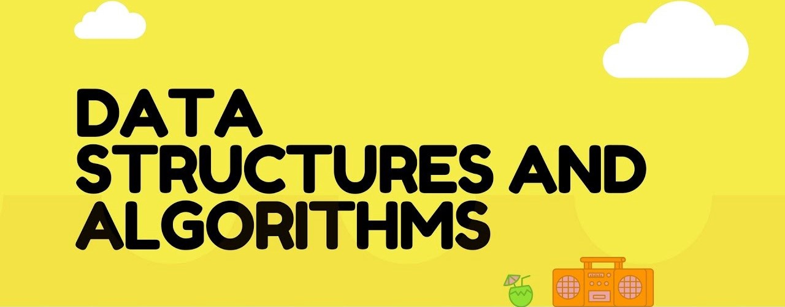
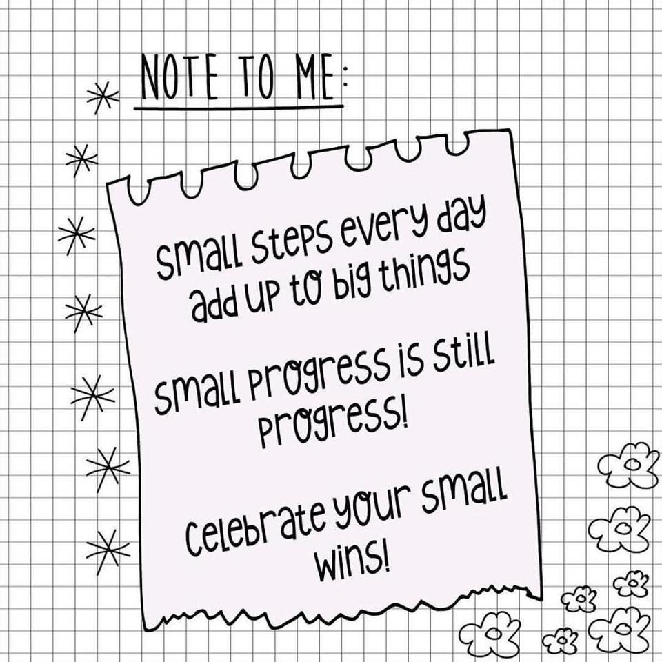

# Data Structures and Algorithms

##  Table of contents:
- <i> [Introduction](#intro) </i>

- <i> [Data Structures](#ds) </i>

- <i> [Algorithms](#algo) </i>

- <i> [Problems](#problems) </i>

## Introduction
This repository is my implementation of some Data Structures and Algorithms by C++ and Python. 

  

Its more like the diary of my self-learning about DSA. 🤗

I like to learn things the most relaxed way, i will spend my free time to update this. 

Don't force to learn all the things so quickly. Slowly but surely.

  

In folders, i will try to add the explanation for clearly understanding. 💪 😘

## Data Structures

Implementations of various types of data structures
  
| Name | Link | Some resources |
| :------------ | :----------: | :----------: |
| Array | "" | "" |
| Linked list | "" | "" |
  

## Algorithms

Some typical and interesting algorithms 

| Name | Link | Some resources |
| :------------ | :----------: | :----------: |
| "" | "" | "" |
| "" | "" | "" |

## Problems 

| Name | Link | C++ | Python3 |
| :------------ | :----------: | :----------: | :----------: |
| Array | "" | ✔️ | ✔️ | 
| Linked list | "" | ✔️ | ✔️ | 

